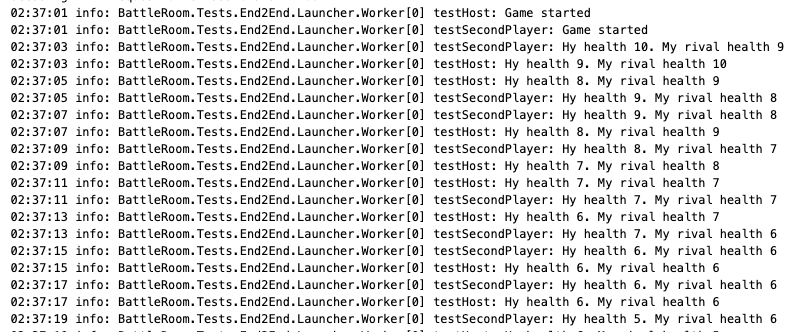

# test-api-game
Example with ASP .NET Core and SignalR for simple game

#How to run
To run end2end test you can use docker-compose file (or you might run applications in debug). 
Test emulates gameplay:
 - Register players
 - Create the lobby with host
 - Join the lobby second player
 - Describe gameplay in logs

You can see the gameplay in the logs of the battle-room-end2end-test service.

